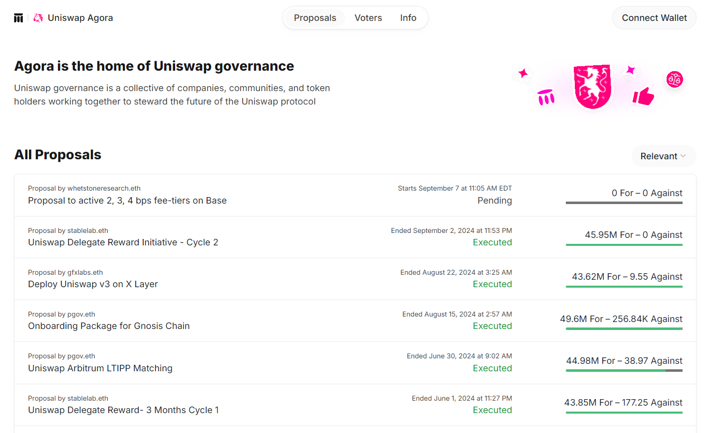
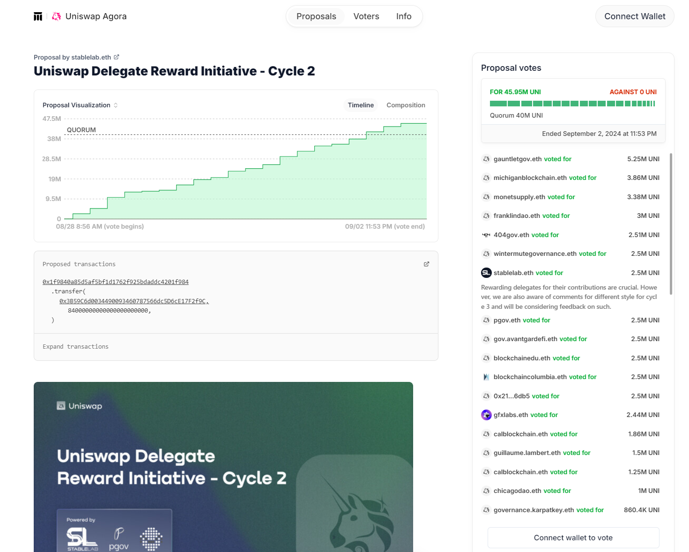
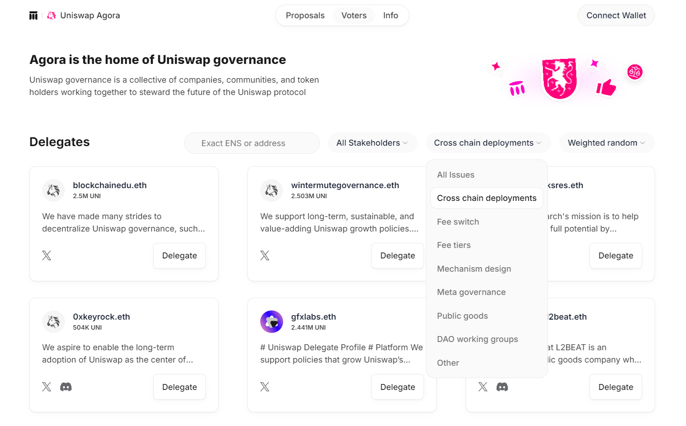
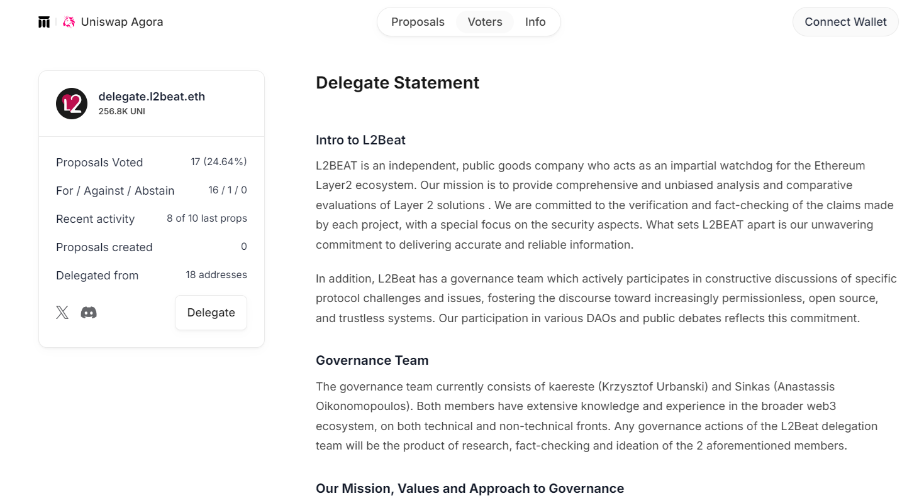
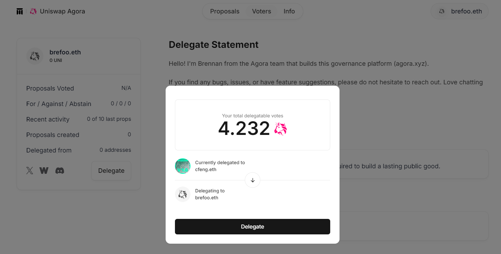
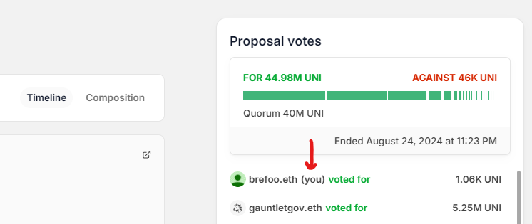

This guide contains everything you need to start voting in Uniswap Governance.

In order to participate you will need:

- [UNI Tokens](https://uniswap.org/blog/uni/)
- ETH for transaction costs
- A Crypto wallet that supports the Ethereum protocol and holds UNI Tokens. Like the [Uniswap wallet](https://wallet.uniswap.org/).
- To [delegate](#delegation) your tokens before the vote is active.

The governance [process](./02-process.md) begins in the [Governance Forum](https://gov.uniswap.org/), where you can find proposals under consideration, gather information about community sentiment, and engage with the community.

Once a given proposal has made it through the proposal process and is ready for voting, it will appear in the Uniswap [voting dashboard](https://vote.uniswapfoundation.org/) - where you can view all current and former Uniswap proposals.

Clicking a proposal will show all the necessary information, documentation, and discussion needed for a voter to make an informed decision, and help visualize how the voting transpired.

Once a proposal has reached the voting stage it represents real, executable code which will alter the functionality of Uniswap Governance or anything under its jurisdiction. Proper care should be taken to ensure that the code represented in the proposal has been audited and is found to be in good faith.

## Delegation

UNI is a tradable asset and functions like most other standard ERC20 tokens, except it has a deeper power as a voting mechanism. In order for UNI to be used as a vote, the owner must first go through the delegation process. Delegating UNI binds the voting power of your tokens to an address so it may be used to vote. This address could be yourself, or a trusted party who you believe will vote in the best interest of Uniswap Governance.

A democratic consensus, in our process called “quorum”, is determined by the percentage of UNI tokens in favor of, or against, a proposal. 1% of all UNI must be cast in favor to submit a proposal, and 4% in order to pass a vote.

To delegate your UNI tokens and enact their voting power, visit the [Uniswap voting dashboard](https://vote.uniswapfoundation.org/delegates). Connect your Wallet, browse delegates, and click "Delegate" on your chosen delegate.

You can also delegate to yourself if you wish to participate in voting directly. After connecting your wallet, click your wallet address, then "view my profile." From there, you can click "Delegate" on your own profile to delegate your voting power to yourself.

Once you click this button, you will see a screen that gives you the option to self delegate, or add a delegate address. If you wish to delegate your UNI voting power to your own address, click “Self Delegate”. You can also update your delegation at any time.

When you click “Self Delegate”, a transaction will pop up in your wallet (e.g. Metamask).  If this doesn’t happen, double check that wallet is connected correctly, turn off any popup blockers, and try again. Click confirm, and once the transaction has processed, you will see that the voting power on your profile has been updated. Note that delegating your voting power is an event that is captured on chain, so setting and updating your delegation costs gas.

An important note: much like voter registration in a larger democracy, for UNI to be used in a vote it must be delegated before both the voting period and the preceding proposal period. This means if you want your vote to count, you must delegate it in anticipation of any proposal you may be interested in.

If you are unsure of how best to vote and are interested in delegating your UNI voting power to another party, you can visit the [Delegation Pitch](https://gov.uniswap.org/c/delegation-pitch/6) section of the governance forum. Here parties participating in Uniswap Governance pitch their platform and voting agenda for users to read and discuss.

## Voting

If you have successfully self delegated and there is an active proposal, you are ready to vote in Uniswap Governance.

To cast your vote, navigate to the proposals page and click on an active proposal.

After reviewing the attached details and deciding your opinion, choose “Vote For”, or “Vote Against”.

Once you’ve chosen, a window will pop up allowing you to execute the vote.

When you click to cast your vote, your wallet will pop up asking you to confirm your transaction. Click “submit” or "confirm", wait a bit, and check that the transaction has been confirmed. You can view your votes from your profile, or on the proposal itself.

That’s it! Once your transaction has been confirmed, you will have cast your vote and participated in Uniswap Governance.
